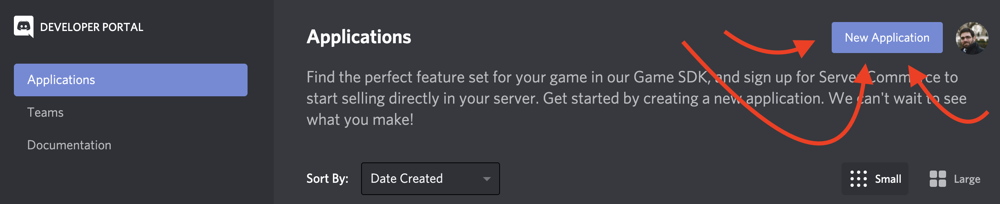
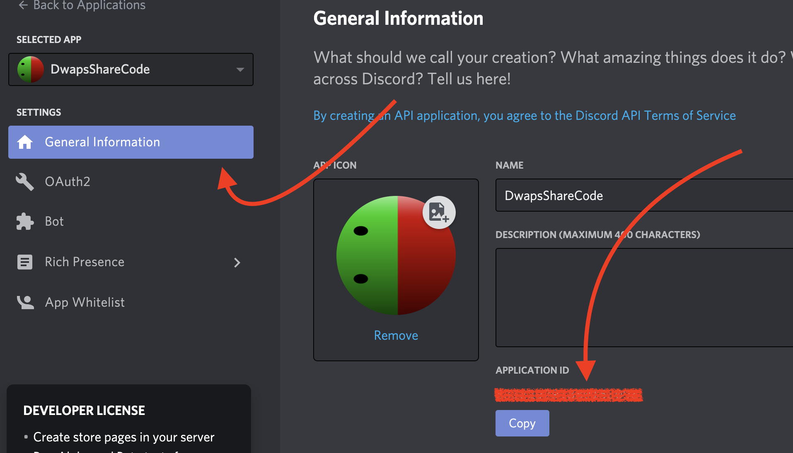
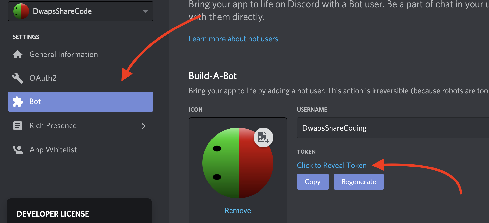

## Extension VSCode: Discord Sharing Code

Support pédagogique de formation: outil permettant l'envoi d'exemples de code aux élèves.

---

### Installation

1. Créez un bot Discord: [https://discord.com/developers/applications](https://discord.com/developers/applications)

2. Récupérez :
▶︎ l'identifiant de l'application dans le menu *'General Information'*.

▶︎ le token de votre bot Discord depuis le menu *'Bot'*.

3. Lancez la commande VSCode **"Dwaps: Initialize Extension"** `(Ctrl+Shift+P ou Cmd+Shift+P)` et entrez les informations pour initialiser votre extension VSCode.

---

### Utilisation

1. Lancer la commande VSCode **"Dwaps: Connect Bot to a specific Discord channel"** `(Ctrl+Shift+P ou Cmd+Shift+P)` et entrez l'identifiant du salon textuel de votre choix.
[Comment trouver cet identifiant ?](#identifiant-du-salon-textuel)
2. Pour partager du code, il suffit de se positionner dans le fichier de son choix et de lancer la commande VSCode **"Dwaps: Share Code"** `(Ctrl+Shift+P ou Cmd+Shift+P)`.

---

##### Identifiant du salon textuel

Pour trouver l'identifiant du salon auquel connecter le bot, il suffit de cliquer droit dessus. Le menu contextuel qui s'affiche offre alors la possibilité de copier l'identifiant par un simple clic

---

[® DWAPS Formation - Michael Cornillon](https://dwaps.fr "DWAPS")
